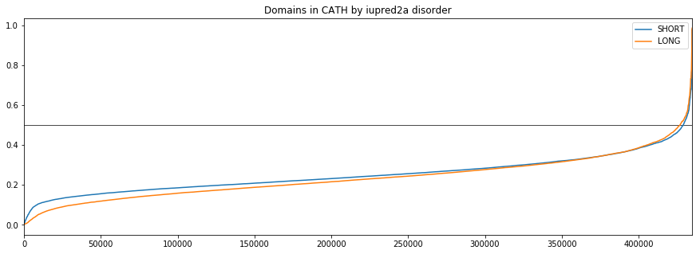
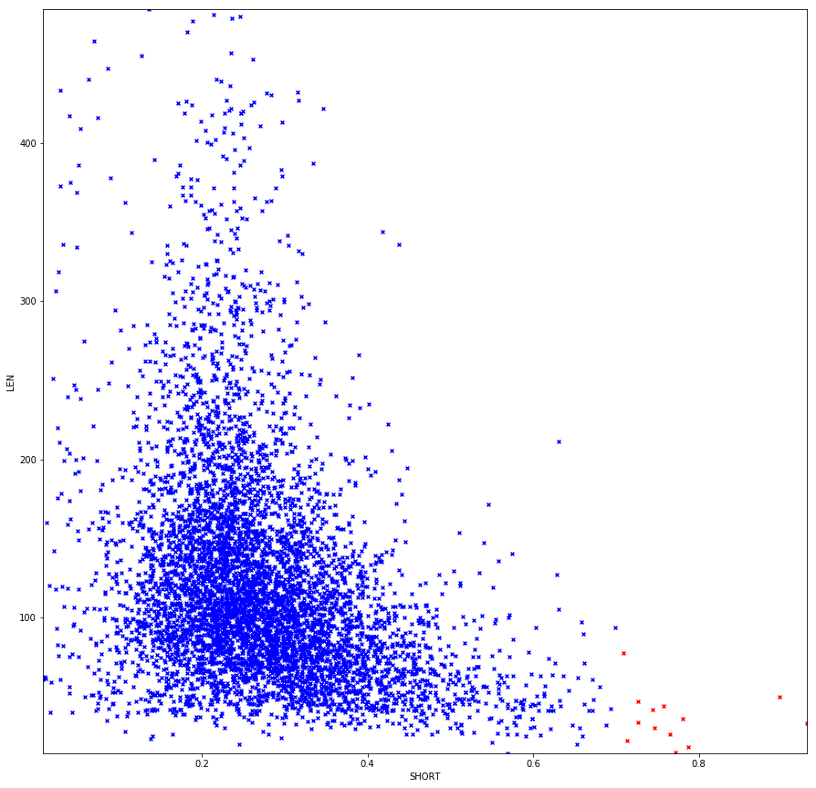
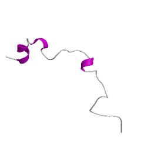
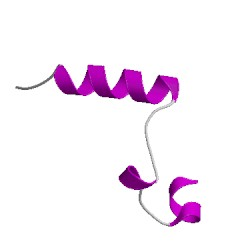

# Disorder in CATH

## Introducion

**Iupred2a** is a python script that predicts the disorder of each amino acid based on the biophysical properties. It uses a fasta file as an input and produces a table as an output.

I used the iupred on all the sequences of domains in CATH to analyse domains and superfamilies that stand out.

## Reproducing
1. Download all the seqences in CATH from FTP server
2. Extract the fasta sequences into separate files for each domain and separate folders for each superfamily using [extract_fasta]('./scripts/extract_fasta.py') script
3. Using the [designated script](./scripts/perform_full_iupred.sh) create a .long and .sjort file for each domain file, with calculated Disorder. Long and short stand for different calculation methods in iupred.
4. Using the [get_mean](./scripts/get_mean.py) script calculate the mean for each domain and put it into 2 tsv files (long and short)
5. Using [the big compiler script](./scripts/compile_all_data.py) put all info about each domain into [one big tsv]('./compiled.tsv')
6. Using the compile_sfam function in the [module](./CATH_disorder.py) compile info about each SFAM into [another big tsv](./sfam_compiled.tsv)

## Results
*in progress*

### Domains

The initial analysis suggests that most domains in CATH fall under the 0.5 cutoff range, as seen in graph below.

### Superfamilies

The scatter plot below allows us to see that most of the superfamilies with high disorder are relatively short - all superfamilies that have over 0.7 disorder are less than 100 aminoacids long.

### Case study

2 superfamilies - [4.10.990.10](http://www.cathdb.info/version/latest/superfamily/4.10.990.10) and [1.20.5.560](http://www.cathdb.info/version/latest/superfamily/1.20.5.560) have an unusually high disorder - 97%. The visual study of the representative structures suggests that this is probably a bad chopping.

4.10.990.10

1.20.5.560

