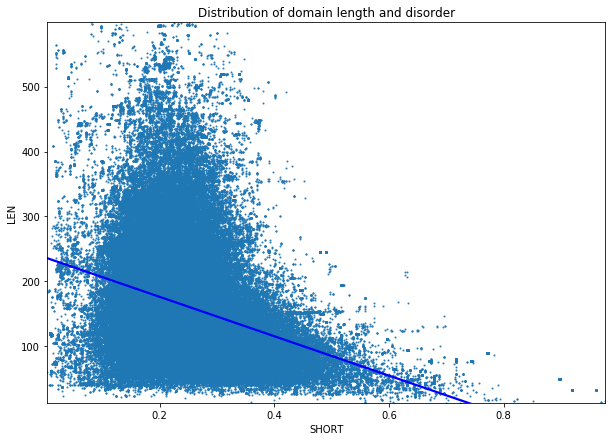
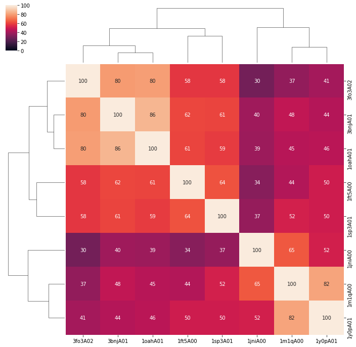

# Filtering superfamilies in CATH

### Table of contents

1. [Disorder](#disorder)
2. [Length](#length)
3. [SSAP](#ssap)

## Disorder

### Description

**Iupred2a** is a python script that predicts the disorder of each amino acid based on the biophysical properties. It uses a fasta file as an input and produces a table as an output.

I used the iupred on all the sequences of domains in CATH to analyse domains and superfamilies that stand out.

### Reproducing
1. Download all the seqences in CATH from FTP server
2. Extract the fasta sequences into separate files for each domain and separate folders for each superfamily using [extract_fasta]('./scripts/extract_fasta.py') script
3. Using the [designated script](./scripts/perform_full_iupred.sh) create a .long and .sjort file for each domain file, with calculated Disorder. Long and short stand for different calculation methods in iupred.
4. Using the [get_mean](./scripts/get_mean.py) script calculate the mean for each domain and put it into 2 tsv files (long and short)
5. Using [the big compiler script](./scripts/compile_all_data.py) put all info about each domain into [one big tsv]('./compiled.tsv')
6. Using the compile_sfam function in the [module](./CATH_disorder.py) compile info about each SFAM into [another big tsv](./sfam_compiled.tsv)

### Results

Overall it seems like domains and superfamilies that have a disorder score of 0.7 or more (short iupred method) should be excluded from CATH due to absence of conserved structure.

#### Domains

The initial analysis suggests that most domains in CATH fall under the 0.5 cutoff range, as seen in graph below.

The scatter plot below allows us to see that most of the superfamilies with high disorder are relatively short and that there is an inverse corellation between domain length and disorder.

***
## Length

### Description

Length is a good indicator of consistency in a superfamily - one would expect that most superfamilies have domains of relatively similair length. Standard deviation of domain length in a superfamily is a good indicator of badly clustered superfamilies.

(*to be added*)
***
## SSAP

### Description

Most domains are added to CATH based on single linkage - only relation to one other domain in the superfamily is taken into account. This part of the research is supposed to take a look at the clustering of domains in superfamilies based on SSAP score between S35 representative domains

In order to perform this analysis 2 matrices were created for each superfamily, which contain information about the SSAP scores and overlap percentage between each S35 domain in CATH. They can provide info on domains which are severe outliers in the superfamily.

### Examples

#### [3.30.365.10](http://cathdb.info/version/latest/superfamily/3.30.365.10)

* Domains - 431
* S35 representative domains - 27
* Unique PDBs - 57

As we can see from the clustermap below, most domains have a relatively high SSAP scores within the superfamily, with the exception of 2ckjB00

2ckjB00 has a low mean SSAP and mean overlap percentage compared to the rest of the domains - 48.45 and 11.58% respectively.

Visual analysis confirms that 2ckjB00 looks different than other domains

**2ckjB00**

**3hrdB01**

***
#### [1.10.1130.10](http://cathdb.info/version/latest/superfamily/1.10.1130.10)

* Domains - 149
* S35 representative domains - 8
* Unique PDBs - 74

This superfamily is different from the previous example - most representative domains have 1 or 2 other domains with high SSAP score but the scores for other domains are quite low, which leads to clusters with high diversity.

As we can see only domain 1jniA00 has a lower overall mean SSAP score however, the difference is not as striking. The structure of each representative domain is quite different from others in the superfamily.
