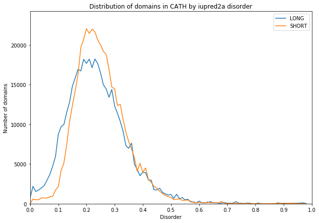

# Disorder in CATH

## Introducion

**Iupred2a** is a python script that predicts the disorder of each amino acid based on the biophysical properties. It uses a fasta file as an input and produces a table as an output.

I used the iupred on all the sequences of domains in CATH to analyse domains and superfamilies that stand out.

## Reproducing
1. Download all the seqences in cath from FTP server
2. Extract the fasta sequences into separate files for each domain and separate folders for each superfamily using [extract_fasta]('./extract_fasta.py') script
3. Using the [perform_iupred](./perform_iupred.sh) script create a .result file for each domain file, with calculated Disorder
4. Using the *deleted* script calculate the mean for each domain and put it into one tsv
5. ...

**To be improved**

## Results

The initial analysis suggests that most domains in CATH fall under the 0.5 cutoff range, as seen in graph below

Only a small percentage (1.8%) of domains have a mean disorder score over 0.5. Among the superfamilies, only 3.2% of superfamilies have a mean disorder score higher than 0.5, which suggests that the superfamilies with higher disorder are smaller.

### Case study

2 superfamilies - [4.10.990.10](http://www.cathdb.info/version/latest/superfamily/4.10.990.10) and [1.20.5.560](http://www.cathdb.info/version/latest/superfamily/1.20.5.560) have an unusually high disorder - 97%. The visual study of the representative structures suggests that this is probably a bad chopping.

4.10.990.10

1.20.5.560

